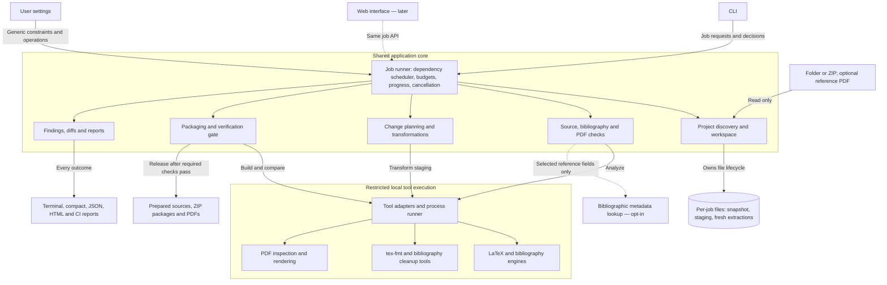
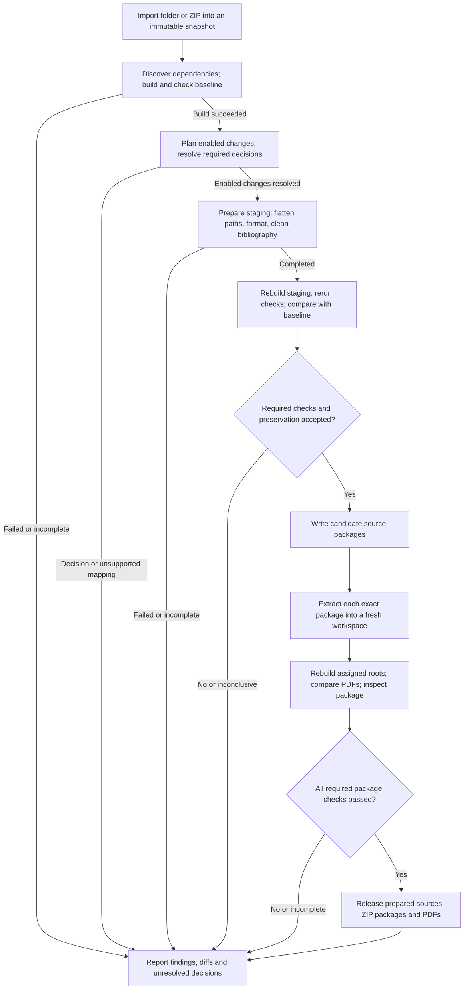
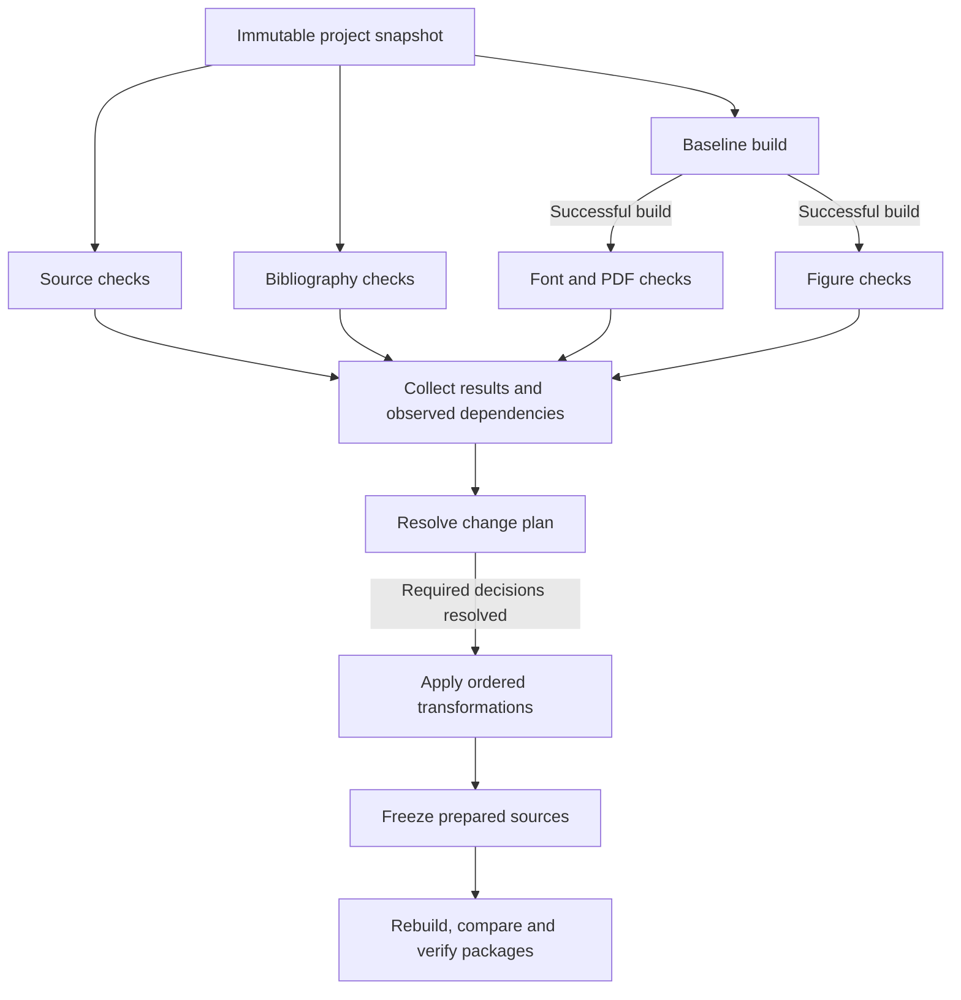

# Fledge architecture

Architecture based on [the requirements](requirements.md). The application uses Python with a CLI, a shared application core, and isolated tool execution. A later web interface calls the same job API; its deployment model remains open. The [README](README.md) describes the implemented subset and current limitations.

## Component diagram

Solid arrows show calls or access; return values are omitted. Dotted arrows identify the later web interface and optional network lookup. The core boxes are modules within one application.

The job runner supplies each module with the selected roots, effective settings, appropriate workspace paths, and accumulated results. All source mutation is confined to staging. Checkers return findings; transformations return changes; neither decides independently that a package is ready.

## Module responsibilities

| Module | Responsibility |
| --- | --- |
| Job runner | Validate configuration; schedule ready tasks within resource budgets; expose progress and cancellation; collect decisions and final status |
| Project discovery and workspace | Safely import ZIPs, preserve the input snapshot, discover roots and dependencies, manage isolated working directories |
| Checkers | Inspect source, references, metadata and PDF output; keep execution status, severity and evidence type separate |
| Change planning and transformations | Build a reviewable change plan; flatten paths with collision-safe renaming; format, clean bibliography and remove selected files |
| Packaging and verification | Build baselines and prepared copies, compare PDFs, write candidate packages, rebuild fresh extractions, control release |
| Reporting | Collect findings, path mappings, diffs and verification results for terminal, compact, JSON, HTML and CI output; a later web adapter reuses the same results |
| Tool adapters and process runner | Translate structured operations into bounded local tool invocations; capture diagnostics; enforce restricted file access and no network |

Build orchestration may use `latexmk` with the selected TeX engine and BibTeX/Biber. `tex-fmt` and bibliography tools sit behind adapters; the PDF library remains undecided. Internal path rewriting owns dependency-aware flattening. Third-party cleanup tools operate only within the selected change plan.

## Preparation lifecycle

This view shows the required stage boundaries inside the job runner. Independent tasks within a stage may run concurrently, as described under parallel execution. The component diagram above shows ownership and dependencies.

Once flat layout is enabled, supported file moves, collision renaming and reference updates run automatically. An unresolved mapping produces a precise finding. Merging all LaTeX content into one file remains a separate optional transformation.

Each separately delivered source package contains its own dependencies and is rebuilt independently. A supplementary dataset that is not a TeX document receives file and layout checks. When supplied, the reference PDF is compared separately with the original-source build and the final package build.

Every stage can produce diagnostics. A baseline failure still permits source inspection and proposed patches, but prevents a verified preparation result. Dry runs stop at the plan; explicitly requested diagnostic exports remain visibly unverified. Accepted exceptions are reported separately from a clean pass.

## Parallel execution

The Job Runner owns a bounded dependency scheduler. Each submission has a directed acyclic graph of tasks: a task can start when its prerequisite conditions are met and the required execution capacity is available. The first release uses one coordinating process, a bounded worker pool, and restricted tool subprocesses. Scheduling remains independent of the CLI so the web interface can reuse it later.

Each task declares its prerequisite results, input state, output locations, resource needs, timeout, and whether it is required for the requested result. Distinguish dependencies requiring successful artifacts from reporting and cleanup tasks requiring only completion; diagnostics must still run after failures. The scheduler rejects invalid dependencies and reports an unsatisfiable resource request instead of waiting indefinitely. Check logic stays in the checkers; the scheduler manages readiness, capacity, completion and cancellation.

### Tasks that can overlap

| Work | Parallel execution | Required boundary |
| --- | --- | --- |
| Source and bibliography checks | Run alongside baseline compilation | Read the immutable input snapshot |
| Independent document builds | Build different roots concurrently | Separate build directories; explicit dependencies for cross-document inputs |
| PDF and figure checks | Inspect fonts, metadata, geometry and figures concurrently | Consume a completed, immutable PDF from a successful build |
| Metadata lookups | Query independent references concurrently | Separate network client with provider-specific limits and request deduplication |
| Formatting | Compute changes for independent files concurrently | Workers produce patches or temporary outputs; the coordinator applies them |
| Flattening and citation-key changes | Apply as coordinated, ordered transformations | Complete project-wide mappings before any dependent operation starts |
| Final package verification | Rebuild independent source packages concurrently | Fresh extraction and isolated build directories for each package |

The initial analysis graph illustrates how compilation can overlap with source checks:

This graph shows the successful path; failure and incomplete-result handling follows the lifecycle above. Early source findings can be displayed immediately, but pruning and reference rewrites must wait for the required build, citation-usage and dependency evidence. Independently computed findings that depend on compiled evidence must be reconciled before the plan is applied.

### Resource budgets and workspace ownership

Use a shared CPU and memory budget, with additional concurrency limits for builds, PDF rendering and other expensive subprocesses. Network requests have their own bounded concurrency and provider rate limits. Account for subprocesses that create their own workers; separate pools must not each assume that all machine resources are available. A serial execution mode must remain available for diagnosis and equivalence checks.

Every build owns its temporary files, output directory and generated bibliography. Passes within one TeX/BibTeX/Biber build remain ordered by the build adapter. Cross-document inputs create explicit dependencies; a separately delivered package cannot obtain a missing dependency from another package's verification workspace.

One coordinator owns changes to each staging tree. Workers may compute disjoint formatting outputs in parallel, but they do not rename or rewrite shared project files independently. Apply the complete flattening map and cross-file citation changes in ordered phases. Run formatting before removing formatter directives. Readers and builds must never observe a partially transformed tree; freeze the prepared source state before rebuilding and packaging.

Parse source, bibliography and PDF content once per relevant input state where practical, then share immutable results with compatible checkers. Do not share mutable parser or PDF handles across workers unless the library supports it. Associate results with the input state, settings and tool versions that produced them, and invalidate dependent work when those inputs change. Cache entries must be published atomically; final archive verification still uses a fresh extraction without reused project build outputs.

### Results and failures

Workers return structured findings, artifacts and progress events to the Job Runner. A single collector produces reports and exit status, and sorts final findings by stable keys such as document, path/page, location and rule name. Worker completion order may affect live progress but must not affect final conclusions, filename mappings or package contents. Timing and event-order information remain separate from deterministic findings.

A failed task prevents tasks requiring its successful output from running; independent checks and diagnostic collection may finish. An optional lookup failure does not cancel local analysis, while a required incomplete check prevents a successful preparation result. Cancellation stops queued work and the relevant subprocess trees, releases resource reservations, preserves diagnostics, and prevents incomplete packages from being released. A suspended review decision must not hold CPU or build slots.

For a future web service, queue submissions through the same scheduler with service-wide resource limits and fair allocation between jobs. Per-job limits alone are insufficient when several users submit projects simultaneously. Each job keeps its own workspace and cancellation scope. Selecting a distributed queue or remote workers is unnecessary for the first release.

The ordered chain of baseline build, transformations, prepared build and final-package rebuild remains. Choose concurrency defaults from representative project timings and peak memory measurements; no particular speedup is assumed.

## Boundaries

- **Input preservation:** originals and the imported snapshot remain unchanged. Tools receive only the job paths needed for their operation and declared toolchain resources.
- **Execution:** builds, formatting and PDF tooling run under resource and file-access limits. Shell escape and network access are disabled by default; imported executable configuration is not trusted implicitly.
- **Network:** optional metadata lookup uses a separate bounded client outside the build sandbox. It receives only enabled reference fields and never gains access to arbitrary manuscript files.
- **Policy:** the application evaluates generic constraints supplied by the user. It contains no maintained publisher or venue profile catalog.
- **Interface:** structured job requests, progress, review decisions, findings and artifacts are shared by CLI and future web adapters. A remote web deployment must add upload isolation, access control and retention controls before accepting projects.

The implementation uses Python 3.11 or later, an async coordinator, bounded task scheduling, and external LaTeX/Poppler/tex-fmt adapters. The CLI uses Click for commands and Rich for terminal reports, with compact and JSON output for agent handoff and automation, plus HTML and CI annotations. Preparation, analysis and verification remain reusable independently of the interface. A central catalogue assigns stable check codes and links every code to behavioral unit tests. Restricted execution uses macOS sandbox-exec or Linux Bubblewrap; unavailable isolation blocks builds. The Linux backend has fixture coverage but still needs live validation on Linux.
